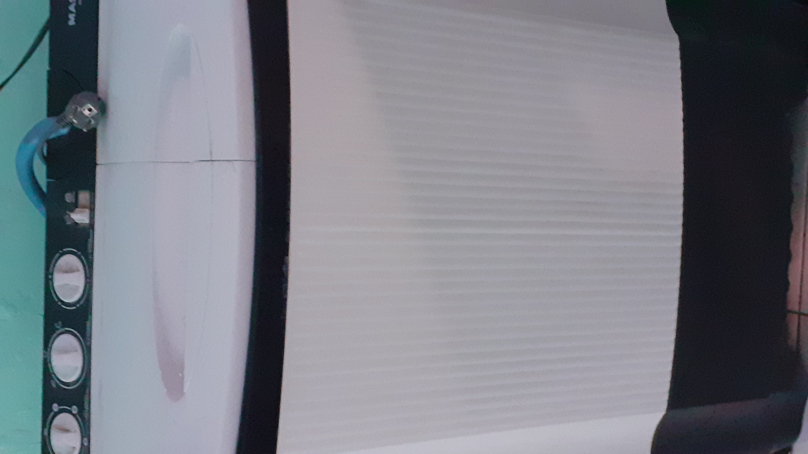
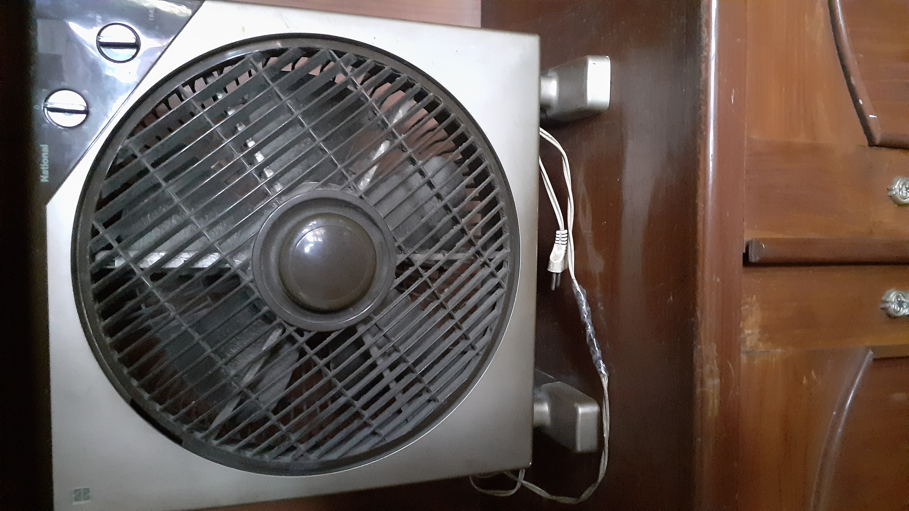
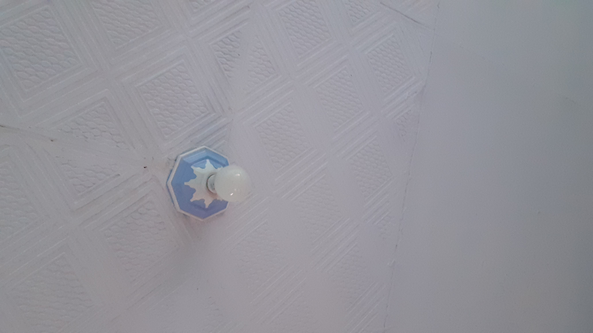
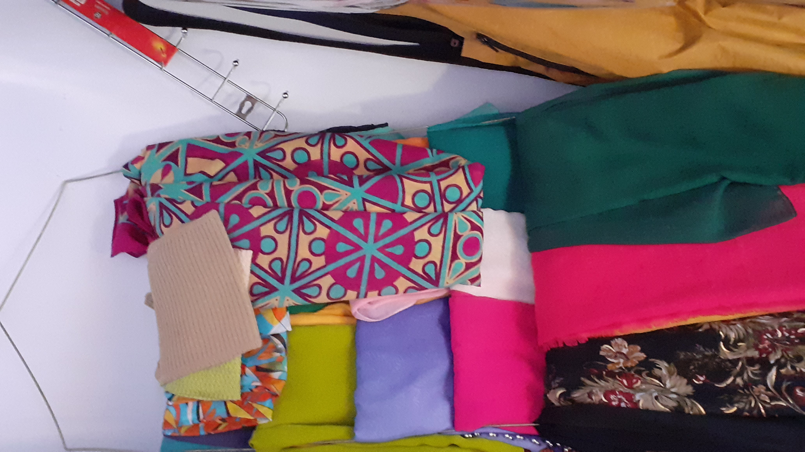

#Laporan Praktikum Pertemuan 1

##Objek Pengamatan
Dari pengamatan lingkungan sekitar saya, saya menemukan 4 benda yang dapat diamati dan dijadikan objec program. Diantara benda yang saya pilih adalah :
1. Mesin cuci
2. Kipas Angin
3. lampu
4. Hanger Hijab

Untuk inheritance (turunan) berupa alat elektronik yang kemudian diturunkan pada benda mesin cuci dan Kipas angin. Karena keduanya merupakan benda elektronik dengan sumber daya listrik. Maka, atribut objec elektronik diantaranya merk, daya, waktu penggunaan, dan biaya listrik. 

Berikut gambar dari benda-benda tersubut.
1. Mesin Cuci

2. Kipas Angin

3. Lampu

4. Hanger Hijab

##Output Program
Untuk Hasil output program berupa cetak informasi dari atribut yang ada pada objek benda. Seperti hanger hijab mempunyai atribut jenis hijab dan jumlah hijab. Mesin cuci mempunyai atribut fitur, kapasitas dan jenis mesin cuci. dan beberapa benda lainnya.

