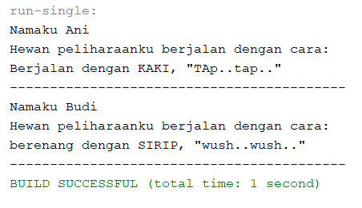

# Laporan Jobsheet 10 - Abstrack Class

## Output percobaan

## Pertanyaan
#### 1.	Berikan penjelasan terkait tentang jalannya program diatas 
- Proses instansiaisi objek yakni object kucingKampung dan lumbalumba sesuai dengan kelasnya masing-masing.
-	Proses instansiasi objek dari class Orang yaitu object ani dan budi. Keduanya membutuhkan parameter yang perlu dimasukkan ke dalam konstruktor. Parameter tersebut berupa atribut nama dengan tipe data String.
-	Object ani dan budi memanggil method peliharaanHewan dengan parameter berupa object dari class Hewan. Ani menginputkan object kucingkampung dan Budi menginpiutkan object lumba.
-	Object ani dan Budi sama-sama memanggil method ajakPeliharaanjalanJalan. Setelah masuk pada method tersebut Program mencetak nama, dan cara bergerak heawan peliharaan dengan cara memanggil method bergerak pada hewanpeiharaan.
#### 2.	Tunjukkan hasil kompilasi program dan berikan penjelasan singkat jika method bergerak() diubah menjadi method abstract! 
-	Jika method bergerak() pada class hewan sudah mengunakan method abstrak, Dan tidak terjadi error pada program. Karena class Hewan merupakan class abstrak :

 
-	Jika method abstrak tersebut diterapkan pada method bergerak() yang ada pada class kucing atau ikan, maka akan terjadi error. Karena class kucing dan ikan keduanya bukan merupakan class abstrak.

  

### 3.	Tunjukkan hasil kompilasi program dan berikan penjelasan singkat jika tidak dilakukan overriding terhadap method bergerak() 
- Jika tidak melakuakan overriding, maka akan terjadi error pada class. Hal ini dikarenakan class tersebut extends kepada class abstrak. Maka harus ada method yang mewarisi class parentnya.

 
### 4.	Tunjukkan hasil kompilasi program dan berikan penjelasan singkat jika abstract method  bergerak()yang dideklarasikan dalam Class Ikan
- jika abstract method bergerak()dideklarasikan dalam Class Ikan. Maka akan terjadi  error karena class ikan bukan merupakan class abstrak dan method bergerak() merupakan pewarisan(overriding) dari class parentnya.

