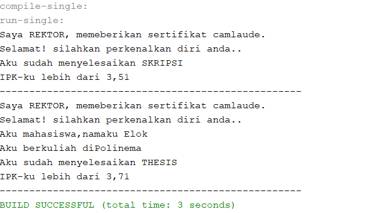
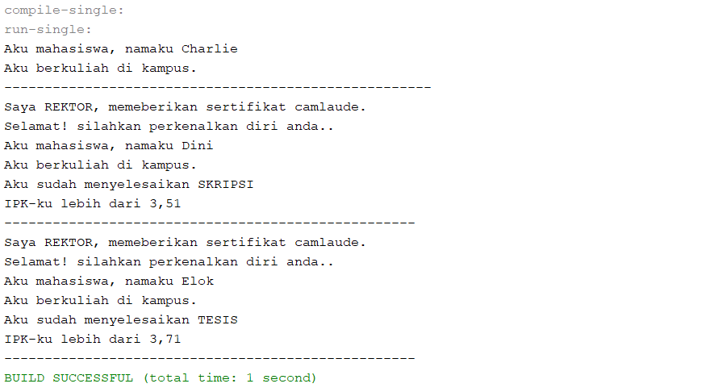
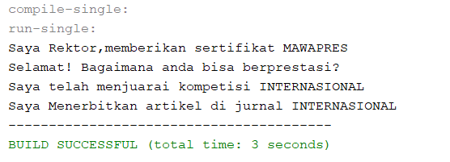
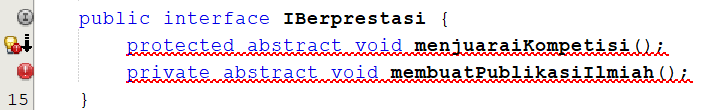
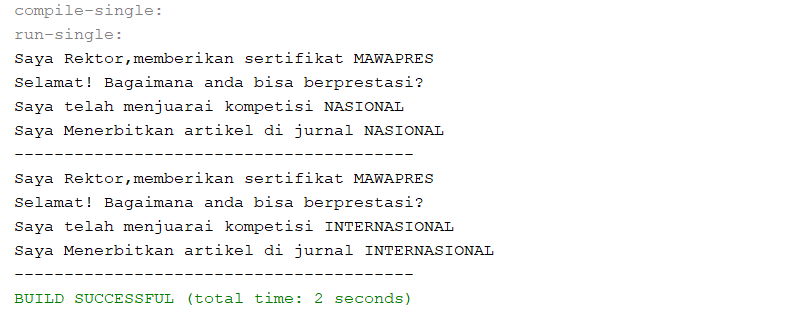
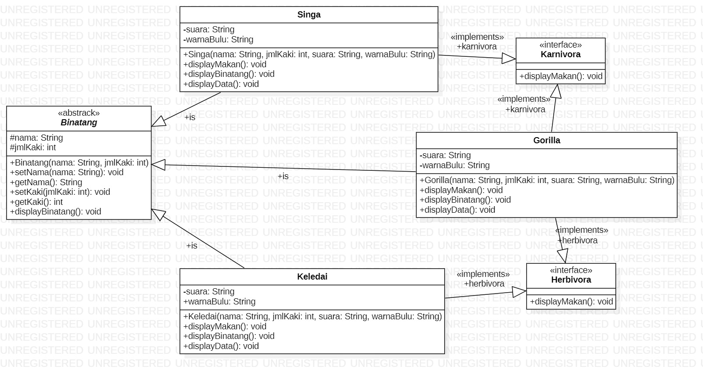
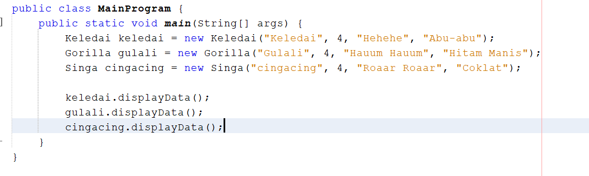
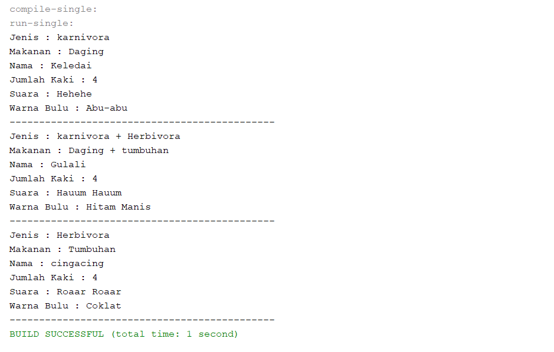

# Laporan Jobsheet 11 - Interface
## Percobaan 1
#### Output :

### pertanyaan :

1.	Pada langkah ke 9, pada baris program ke 3 terdapat warning pada script tersebut. Jelaskan penyebab terjadinya hal tersebut?
- Karena class tersebut terdapat pada satu package yang sama.
2.	Pada langkah ke 9, pada baris program ke 3. Apa yang terjadi jika script tersebut dihilangkan? Jelaskan menurut pemahaman anda.  
- Compile tetap sukses. Hal tersebut tidak mempengaruhi karena tidak ada instansiasi dari class Icamlaude yang dipanggil dalam main class tersebut.
3.	Mengapa pada langkah nomor 9 terjadi error? Jelaskan! 
- Karena class mahasiaswa masih belum di implement ke class interface ICamlaude. Dan tipe data  parameter pada method beriSertifikatCamlaude() pada class rektor berupa tipe data Icaumlade bukan mahasiswa.
4.	Dapatkah method kuliahDiKampus() dipanggil dari objek sarjanaCumlaude di class Program? Mengapa demikian? 
- Bisa. Karena metjod kuliaDiKampus() merupakan method dari class Mahasiswa yang merupakan superclass dari class sarjana.
5.	Dapatkah method kuliahDiKampus() dipanggil dari parameter mahasiswa di method beriSertifikatCumlaude() pada class Rektor? Mengapa demikian? 
- Bisa jika parameter pada method kuliahDiKampus() tipe datanya diubah menjadi mahasiswa dan pada class mahasiswa ditambah implement ke Icamlaude.
6.	Modifikasilah method beriSertifikatCumlaude() pada class Rektor.
- 

## Percobaan 2
### Output :

### Pertanyaan :

1.	Pada script code interface IBerprestasi, modifikasi script tersebut sesuai dengan gambar 
dibawah ini. Dari perubahan script diatas, apa yang terjadi ? serta jelaskan alasannya (capture hasilnya)
 - Terjadi error, Karena modifier yang dapa digunakan paad class interface adalah public dan abstrak. 
2.	Perhatikan script code dibawah ini :. Jelaskan menurut anda, mengapa hasil dari script code tersebut error ?
- Karena class Interface tidak dapat dibuat objek instance-nya dengan kata kunci new. Hal tersebut akan menyebabkan error.
3.	Apabila Sarjana Berprestasi harus menjuarai kompetisi NASIONAL dan menerbitkan artikel di jurnal NASIONAL, maka modifikasilah class-class yang terkait  pada aplikasi Anda agar di class Program objek pakRektor dapat memberikan sertifikat mawapres pada objek sarjanaCumlaude.
- 

## Tugas
### Class Diagram

### Class Main

### Output 

