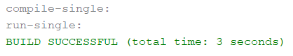
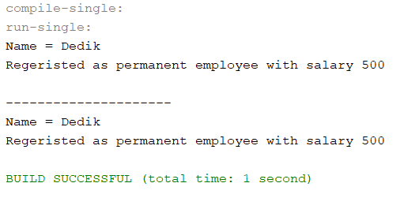
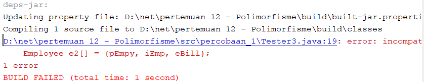
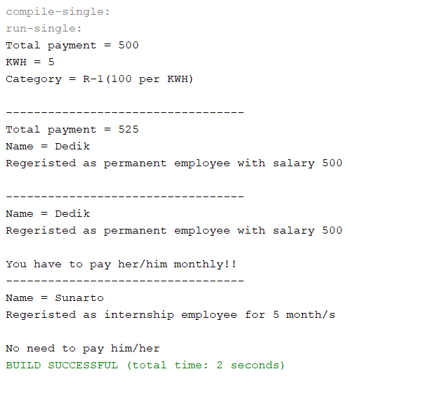
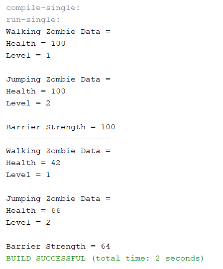

# Laporan Jobsheet 12 - Polimorfisme
## Percobaan 1
###	Output :
 

### Pertanyaan :
1.	Class apa sajakah yang merupakan turunan dari class Employee?
- InternshipEmployee dan PermanentEmployee.
2.	Class apa sajakah yang implements ke interface Payable?
- PermanentEmployee dan ElectricityBill.
3.	Perhatikan class Tester1, baris ke-10 dan 11. Mengapa e, bisa diisi dengan objek pEmp (merupakan objek dari class PermanentEmployee) dan objek iEmp (merupakan objek dari class InternshipEmploye) ?
- Karena pEmp adalan instance dari PermanentEmployee dan iEmp adalah instance dari InternshipEmployee, di mana keduanya kelas tersebut merupakan subclass (turunan) dari class Employee. Sedangkan e adalah instance dari kelas Employee. 
4.	Perhatikan class Tester1, baris ke-12 dan 13. Mengapa p, bisa diisi denganobjekpEmp (merupakan objek dari class PermanentEmployee) dan objek eBill (merupakan objek dari class ElectricityBill) ?
- Karena p merupakan instance dari kelas payable. Sedangkan pEmp adalah instance dari PermanentEmployee dan eBill adalah instance dari class ElectricityBill. Dimana kedua kelas tersebut sama-sama implement ke class interface payable.
5.	Coba tambahkan sintaks:
p = iEmp;
e = eBill;
pada baris 14 dan 15 (baris terakhir dalam method main) ! Apa yang menyebabkan error?
- Yang pertama karena iEmp merupakan objek dari kelas InternshipEmployee dan kelas tersebut tidak implements kepada kelas payable. Sedangkan p adalah objek dari kelas interface payable. Yang kedua karena eBill merupakan objek dari kelas ElectrisityBill dan kelas tersebut bukan termasuk turunan dari kelas Employee.
6.	Ambil kesimpulan tentang konsep/bentuk dasar polimorfisme!
- Polimorfisme adalah kemampuan suatu objek untuk dapat memiliki banyak bentuk objek. Dengan catatan kelas dari bentuk objek tersebut masih ada hubungan dengan kelas objek misal extends atau implements.
## Percobaan 2
###	Output
 

###	Pertanyaan
1.	Perhatikan class Tester2 di atas, mengapa pemanggilan e.getEmployeeInfo() pada baris 8 dan pEmp.getEmployeeInfo() pada baris 10 menghasilkan hasil sama?
- Karena pada pemanggilan e.getEmployeeInfo() merupakan pemanggilan method virtual sehingga bisa memanggil method getEmployeeInfo() yang ada pada kelas permanentEmployee. Sehingga hasil kedua pemanggilan sama.
2.	Mengapa pemanggilan method e.getEmployeeInfo() disebut sebagai pemanggilan method virtual (virtual method invication), sedangkan pEmp.getEmployeeInfo() tidak?
- Karena pemanggilan tersebut merupakan pemanggilan overriding method dari
suatu objek polimorfisme. Saat compile time, compiler akan mengenali method getEmployeeInfo() yang akan dipanggil adalah method getEmployeeInfo() yang ada di class Employee, karena objek e bertipe Employee. Tetapi saat dijalankan (run time), maka yang dijalankan oleh JVM justru method getEmployeeInfo() yang ada di class Deer. Akan berbeda halnya jika pemanggilan method getEmployeeInfo() dilakukan dari objek pEmp (bukan objek polimorfisme), maka method getEmployeeInfo() yang dikenali saat compile time oleh compiler dan yang dijalankan saat runtime oleh JVM adalah sama-sama method getEmployeeInfo() yang ada di class PermanentEmployee (karena objek pEmp dideklarasikan dari class PermanentEmployee).
3.	Jadi apakah yang dimaksud dari virtual method invocation? Mengapa disebut virtual?
- Virtual method invocation adalah pemanggilan overriding method dari
suatu objek polimorfisme. Disebut virtual karena antara method yang dikenali
oleh compiler dan method yang dijalankan oleh JVM berbeda.
## Percobaan 3
### Output
 

### Pertanyaan
1.	Perhatikan array e pada baris ke-8, mengapa ia bisa diisi dengan objekobjek dengan tipe yang berbeda, yaitu objek pEmp (objek dari PermanentEmployee) dan objek iEmp (objek dari InternshipEmployee) ?
- Karena kedua objek tersebut dideklarasi dari kelas yang merupakan subclass dari kelas Employee. Sedangkan e adalah objek dari kelas Employee. Sehingga kedua objek tersebut bisa masuk ke dalam array.
2.	Perhatikan juga baris ke-9, mengapa array p juga biisi dengan objek-objek dengan tipe yang berbeda, yaitu objek pEmp (objek dari PermanentEmployee) dan objek eBill (objek dari ElectricityBilling) ?
- Karena kedua objek tersebut dideklarasi dari kelas yang menerapkan implements kepada kelas Payable. Sedangkan objek p adalah objek yang dibuat dari kelas interface Payable. Sehingga kedua objek tersebut bisa masuk ke dalam array objek p.
3.	Perhatikan baris ke-10, mengapa terjadi error?
- Karena objek eBill dibuat dari kelas ElectricityBill yang tidak memiliki keterkaitan hubungan apapun dengan kelas Employee. Sedangkan objek e2 dibuat dari kelas Employee. Sehingga objek eBill tidak bisa masuk ke dalam array e2.
## Percobaan 4
### Output 
 
 
### Pertanyaan 
1.	Perhatikan class Tester4 baris ke-7 dan baris ke-11, mengapa pemanggilan  ow.pay(eBill) dan ow.pay(pEmp) bisa dilakukan, padahal jika diperhatikan method pay() yang ada di dalam class Owner memiliki argument/parameter bertipe Payable? Jika diperhatikan lebih detil eBill merupakan objek dari ElectricityBill dan pEmp merupakan objek dari PermanentEmployee?
- Karena kelas ElectricityEmployee dan PermanentEmployee sama-sama menerapkan implements kepada kelas interface Payable. Sehingga objek yang berasal dari kedua kelas tersebut dapat digunkan sebagai parameter method pay().
2.	Jadi apakah tujuan membuat argument bertipe Payable pada method pay() yang ada di dalam class Owner?
- Tujuannya agar method pay() bisa menerima nilai argument dari berbagai bentuk objek dari kelas yang berimplements ke kelas Payable.
3.	Coba pada baris terakhir method main() yang ada di dalam class Tester4 ditambahkan perintah ow.pay(iEmp); Mengapa terjadi error?
- Karena objek iEmp merupakan objek yang dideklarasi dari kelas InternshipEmployee, yang bukan termasuk kelas yang ber-implements atau berhubungan dengan kelas Payable.
4.	Perhatikan class Owner, diperlukan untuk apakah sintaks p instanceof ElectricityBill pada baris ke-6 ?
- untuk mengecek apakah objek p merupakan hasil instansiasi dari suatu class ElectricityEmployee.
5.	Perhatikan kembali class Owner baris ke-7, untuk apakah casting objek disana (ElectricityBill eb = (ElectricityBill) p) diperlukan ? Mengapa objek p yang bertipe Payable harus di-casting ke dalam objek eb yang bertipe ElectricityBill ?
- Iya diperlukan. Karena untuk mengubah tipe data objek yang berupa electricityBill menjadi tipe data sesuai dengan superclass yaitu Payable.
## Tugas 
### Output :

