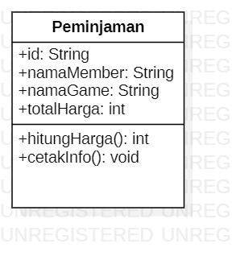

# Laporan Praktikum Pertemuan 2

## Gambar Class Diagram Peminjaman
 Class diagram peminjaman
 

 -Atribut : id, namaMember, namaGame, dan totalHarga.
 -method : hitungHarga() dan cetakInfo().
 Keterangan : class diagram dibuat menggunakan aplikasi mySQL.

## program class Peminjaman (tugas no.2)
contoh output :

keterangan : totalHarga dihasilkan pada method hitungHarga yang menggunakan parameter berupa harga sewa per jam dan lama sewa. kemudian kedua parameter tersebut dikalikan.

## program class lingkaran (tugas no.3)
-atribut : phi, jari-jari(r)
-method : hitungLuas dan hitungKeliling.

contoh output :

Keterangan : kedua method menggunakan tipe data double sehingga membutuhkan nilai kembalian, dan nilai kembalian itulah yang berupa keliling dan luas lingkaran. keliling dihasilkan dari rumus phi * 2 * r. sedangkan Luas dihasilkan dari phi * r * r.

## program class barang (tugas no.4)
-atribut : kode, namaBarang, hargaDasar, dan diskon
-method : hitungHargaJual() dan tampilData()

contoh output :

Keterangan : method hitungHargaJual dibuat dengan tipe data integer yang nantinya nilai kembaliannya berupa harga jual. untuk konversi harga jual, dihasilkan dari perhitungan hargaDasar - ((diskon/100) * hargaDasar)