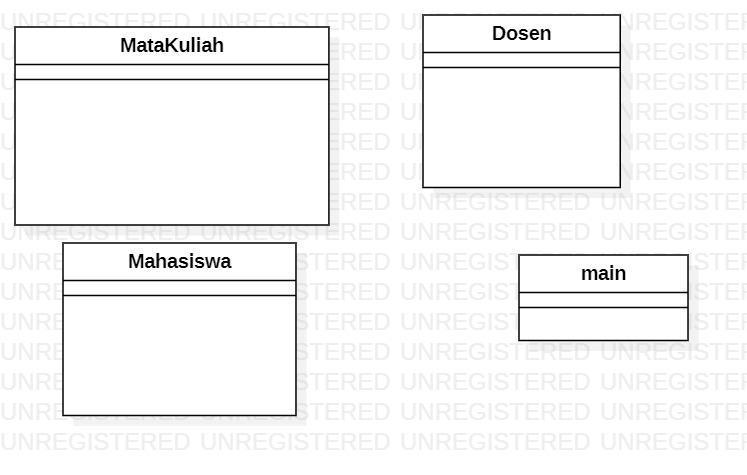
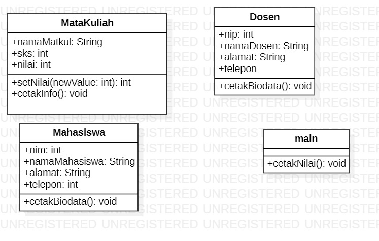

# nama: Naily Ikmalul Insiyah
# Kelas : TI-1D
# NIM : 1941720044

# Latihan 1
## 1. ada 4 class, yaitu : mahasiswa, dosen, matkul, adan main.

## 2. gambar class Diagram sistem Informasi:

# Latihan 2
## class diagram setelah ditambahkan attribut:

# Latihan 3
## implementasi class diagram :
