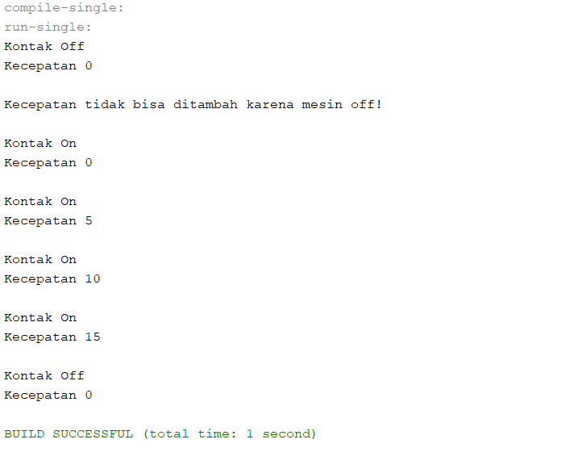
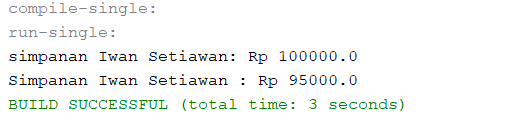
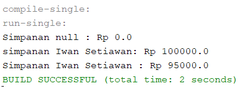
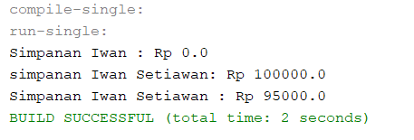

# Laporan Praktikum Pertemuan 3

## Percobaan 1
output :

## percobaan 2
output :

pertanyaan :
1. Pada class TestMobil, saat kita menambah kecepatan untuk pertama kalinya, mengapa 
muncul peringatan “Kecepatan tidak bisa bertambah karena Mesin Off!”? 

karena method tambahKecepatan() dipanggil sebelum method nyalakanmesin(),sehingga mesin masih dalam keadaan off.

2. Mengapat atribut kecepatan dan kontakOn diset private? 

Agar hanya bisa diakses dalam class motor. Dan pada class MotorDemo atribut-atribut tersebut tidak dipanggil lagi. Yang dipanggil hanylah method-method yang ada.

3. Ubah class Motor sehingga kecepatan maksimalnya adalah 100!

source code :

output :

## percobaan 3
output :

## percobaan 4
output 1 :

output 2 :

## Pertanyaan – Percobaan 3 dan 4 

1. Apa yang dimaksud getter dan setter? 

Getter	adalah	public method	dan memiliki tipe data return, yang berfungsi untuk mendapatkan nilai dari atribut private. Sedangkan setter adalah public method yang tidak memliki tipe data return, yang berfungsi untuk memanipulasi nilai dari atribut private.

2. Apa kegunaan dari method getSimpanan()? 

Untuk mendapatkan nilai return yang berupa data besar simpanan, dimana atribut simpanan merupakan atribut private.

3. Method apa yang digunakan untk menambah saldo? 

Method setor(float Uang).

4. Apa yand dimaksud konstruktor? 

method khusus yang akan dijalankan secara otomatis pada saat sebuah objek dibuat (instansiasi), yakni ketika perintah “new” dijalankan.

5. Sebutkan aturan dalam membuat konstruktor? 

- Nama konstruktor harus sama dengan nama class 
- Konstruktor tidak memiliki tipe data return 
- Konstruktor tidak boleh menggunakan modifier abstract, static, final, dan syncronized

6. Apakah boleh konstruktor bertipe private? 

Boleh.

7. Kapan menggunakan parameter dengan passsing parameter? 

Parameter digunakan sebagai variabel untuk pemberian data ketika memanggil suatu method yang membutuhkannya.
Sedangkan passing parameter digunakan sebagai variabel untuk pemberian data ketika memanggil method berupa suatu konstruktor.

8. Apa perbedaan atribut class dan instansiasi atribut? 

Atribut class adalah atribut yang bisa digunakan pada suatu class. dimana atribut tersebut berupa ciri-ciri yang melekat pada suatu object.
sedangkan instansiasi atribut adalah proses pemanggilan suatu atribut yang berasal dari class lain untuk digunakan pada suatu class.

9. Apa perbedaan class method dan instansiasi method?

class method adalah method yang dibuat dan disusun pada suatu class. dimana method sendiri adalah fungsi-fungsi yang dapat digunakan untuk memanipulasi nilai-nilai pada atribut atau untuk melakukan hal-hal yang dapat dilakukan suatu object.
sedangkan instansiasi method adalah proses pemanggilan suatu method yang berasal dari class lain untuk digunakan pada suatu class.

