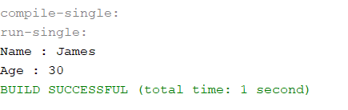
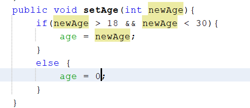
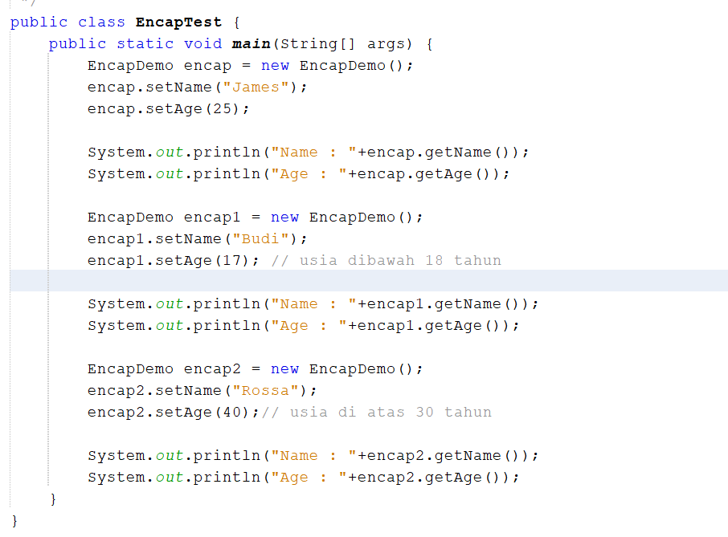
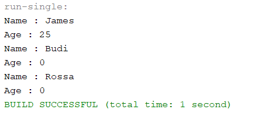
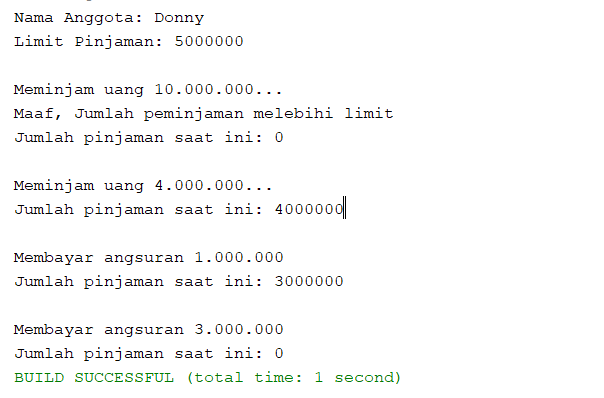
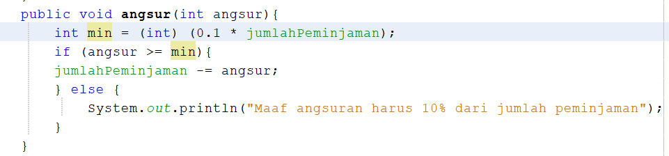
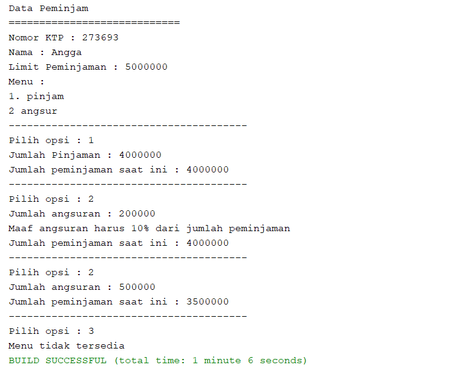

# Tugas Pertemuan 3

1. 
output :

2. Pada	program	diatas, pada class EncapTest kita mengeset age dengan nilai 35, namun pada saat	ditampilkan	ke layar nilainya 30, jelaskan mengapa?

Karena jika nilai dari parameter newAge yang berada dalam kondisi newAge > 10 akan dianggap, age = 30.

3. 
source code :

output :

4. 
output :

5. Modifikasi soal no.4	agar nominal yang dapat	diangsur minimal adalah	10%	dari jumlah	pinjaman	saat ini. jika mengangsur kurang dari itu, maka	muncul	peringatan “Maaf, angsuran harus 10% dari jumlah pinjaman”.

(untuk tampilan output dijadikan satu dengan nomor 6)

6. output :

6. 