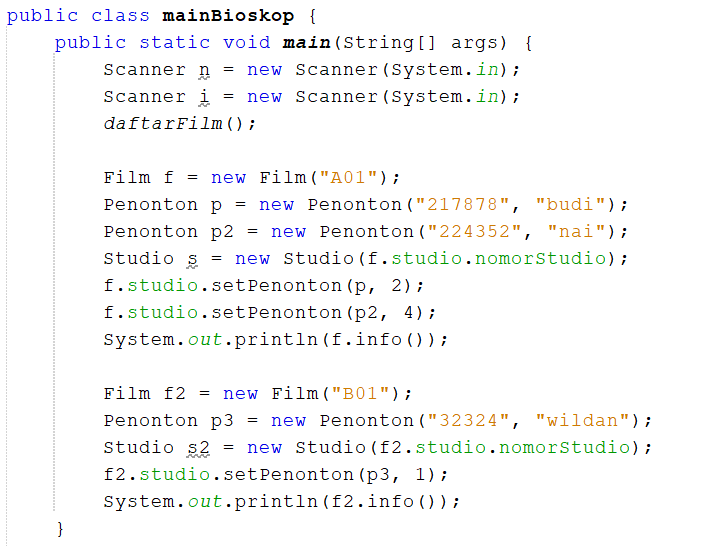

# Tugas PBO pertemuan 4
Naily Ikmalul Insiyah (TI-2C)

## Studi Kasus :
Sebuah bioskop menanyakan beberapa film dan setiap film mempunyai judul, jam penayangan, durasi dan studio. pada program ini kita set setiap studio mempunyai hanya memiliki 10 kursi. Setiap kursi nantinya akan ditempati oleh seorang penonton. Program ini akan menampilkan daftar kursi dan penonton sesuai dengan kode film yang sudah diinputkan.

## Class Diagram :

## contoh input pada class main dan output :

