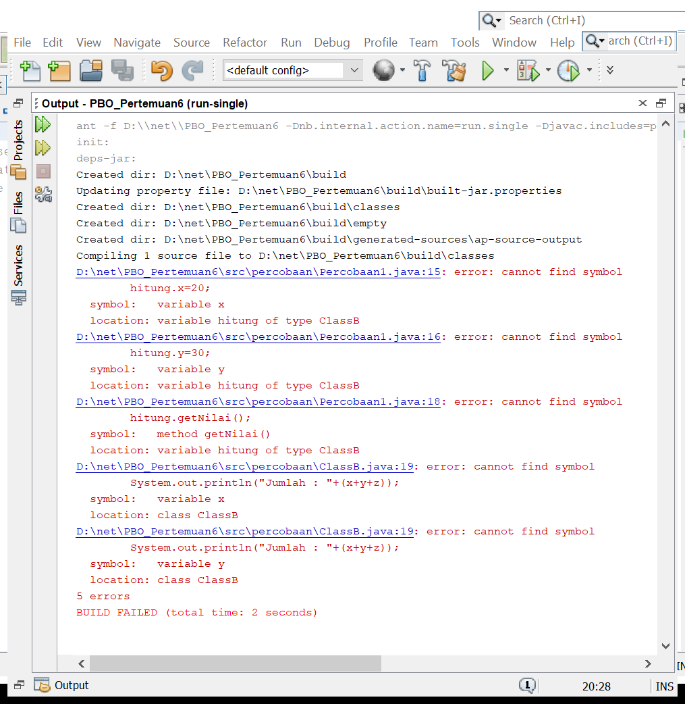
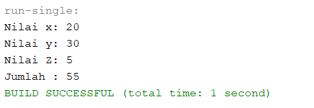
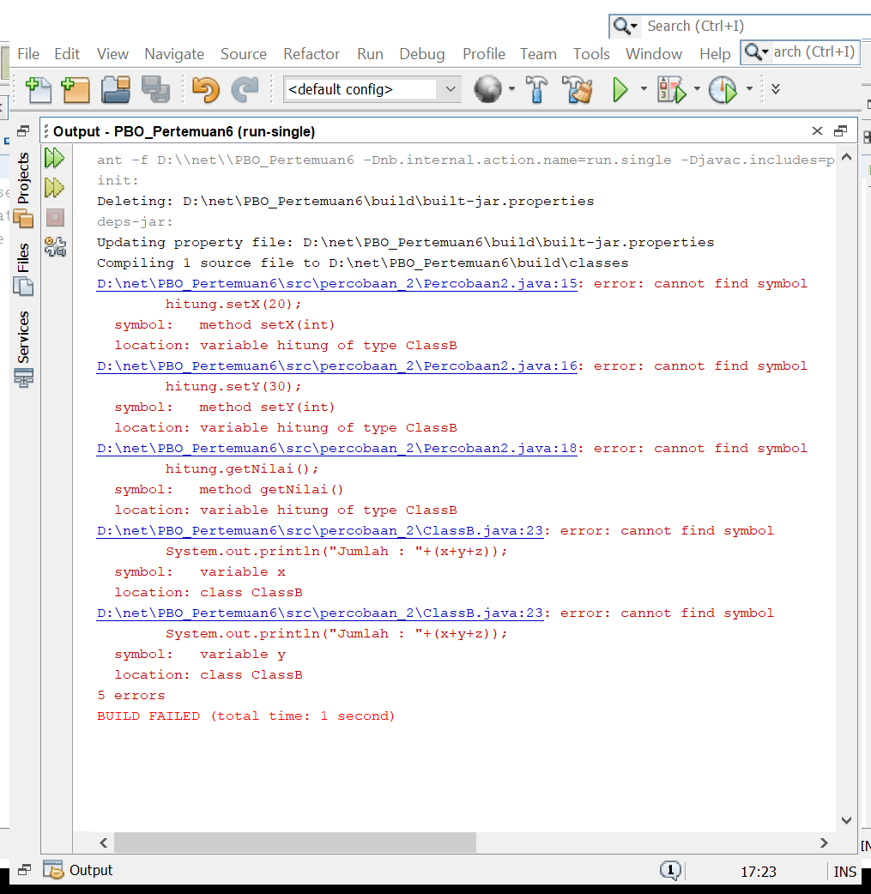
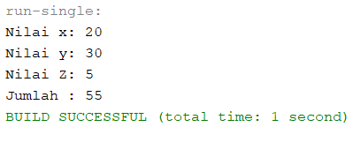
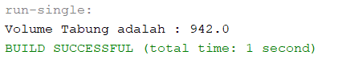
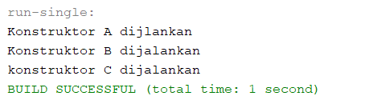
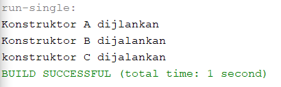
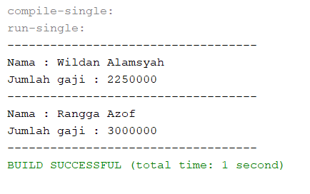

Laporan Jobsheet 6
## percobaan 1
output percobaan 1 error :

Jawaban pertanyaan :

1.  Menambahkan fungsi extends pada class B.
- output :

2. Karena pada classB belum diberi peintah extends untuk menunjukkan bahwa classB adalah inheritance dari classA.

## percobaan 2
Output percobaan 2 error :

Jawaban pertanyaan :

1. 
- Menambahkan method getter pada class A untuk atribut x dan y
 - Menambahkan fungsi extends pada class B
output :

2. 
- Karena pada classB belum diberi perintah extends untuk menunjukkan bahwa classB adalah inheritance dari classA.
- karena pada classA atribut x dan y bermodifier private, jadi tidak bisa diakses di class lain. Maka dari itu, kita perlu menambahkan method getter pada class A. 

## Percobaan 3
output :

Jawaban pertanyaan :

1. Untuk menandakan bahwa parameter yang diinputkan menjadi nilai dari atribut yang dimiliki kelas parent yaitu class bangun.
2. Super digunakan pada atribut phi dan r, untuk menandakan variabel yang dimaksut adalah atribut yang dimiliki kels parent yaitu class bangun. Sedangkan pada atribut t menggunkan this, untuk menandakan bahwa nilai atribut yang dipakai itu atribut yang dimiliki kelas itu sendiri yaitu tabung.
3. Karena class tabung merupakan inheritance dari class Bangun, maka seluruh atribut dan method yang ada di class bangun bisa digunakan di class Tabung dengan syarat modifier yang digunakan memungkinkan.
## Percobaan 4
output :

Jawaban pertanyaan :

1. ClassA superclass dari ClassB(subclass dari classA)
ClassB superclass dari ClassC(subclass dari classB).
2. output dari perubahan konstruktor default :

3. Konstruktor yang dipanggil pada class main akan menjalankan konstruktor yang ada pada class yang sudah diinisialisasi. Jika konstruktor yang dipanggil adalah konstruktor yang dimiliki oleh class yang merupakan subclass(inheritance). Maka, class tersebut akan menjalankan konstruktor yang ada pada superclass-nya terlebih dahulu. Urutan dari jalannya program pada main percobaan 4 yaitu isi yang ada pada konstruktor di classA – konstruktor di ClassB – konstruktor di classC.
4. Untuk memanggil konstruktor yang ada di superclass(parent dari subclass).

## Output dari tugas Penggajian :

