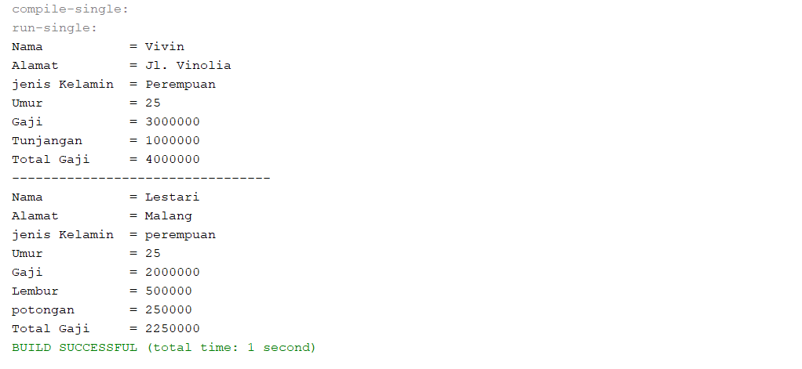
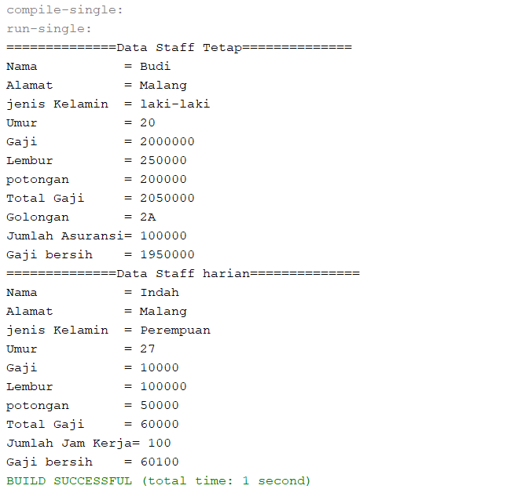
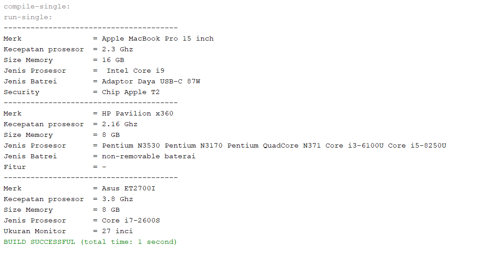

# Laporan Jobsheet 7
## Percobaan 1
Output :

Pertanyaan :
1.	Superclass : Karyawan
Subclass : Manager, Staff
2.	(extends)
3.	Atribut yang dimiliki : tunjangan.
Atribut yang diwarisi dari class Karyawan : nama, alamat, jenis kelamin, umur dan gaji.
4.	Super berfungsi untuk memanggil method atau atibut yang ada pada superclass. Maka, code itu berfungsi untuk memanggil value yang tersimpan pada atribut gaji yang ada di superclass(karyawan).
5.	Termasuk dalam Hierarchical Inheritance karena pewarisan yang terjadi ketika sebuah kelas yaitu class karyawan memiliki lebih dari satu kelas turunan (subclass) yaitu class manager dan staff

## Percobaan 2
Output :

Pertanyaan :
1.	Single Inheritance : Karyawan (superclass)  manager (subclass)
Multilevel Inheritance : 
-	karyawan (superclass)  Staff (subclass dari karyawan dan superclass dari StaffTetap)  StaffTetap(subclass),
-	karyawan (superclass)  Staff (subclass dari karyawan dan superclass dari StaffHarian)  StaffHarian(subclass)
2.	Atribut :
-	Staff Tetap : golongan, asuransi
-	Staff Harian : jumlah jam kerja.
3.	 Untuk menginisiasi/memasukkan value dari atribut yang ada pada class super melalui pemanggilan konstruktor.
4.	 Untuk memanggil method tampilDataStaff pada superclass yaitu class Staff.
5.	Karena atribut lembur dan potongan sudah terdeklarasi di class staff yang merupakan superclass dari class Staff Tetap. Sedangkan gaji adalah atribut dari class Karyawan yang merupakan superclass dari clas Staff. Dan ketiga atribut tersebut bermodifier public sehingga bisa diakses kapanpun di subclassnya.

## Ouput Tugas :
