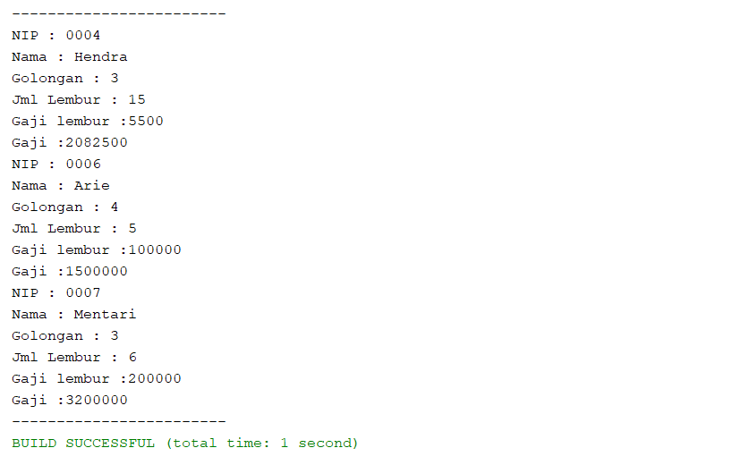

# Laporan Jobsheet 9
## Praktikum
Output :

## Latihan

4.1 Dari source coding diatas terletak dimanakah overloading?

- Terletak pada method perkalian.

4.2 Jika terdapat overloading ada berapa jumlah parameter yang berbeda?
- Ada 2 daftar parameter berbeda, pada method pertama ada 2 parameter dan pada method kedua ada 3 parameter.

4.3 Dari source coding diatas terletak dimanakah overloading?

- Terletak pada method perkalian.

4.4 Jika terdapat overloading ada berapa tipe parameter yang berbeda?

- Ada 2 daftar parameter berbeda, pada method pertama ada 2 parameter dengan tipe data int dan pada method kedua ada 2 parameter dengan tipe data double.

4.5 Dari source coding diatas terletak dimanakah overriding?

- Terdapat pada method swim.

4.6 Jabarkanlah apabila sourcoding diatas jika terdapat overriding
- Overriding terjadi pada method swim(), method tersebut berada pada class parent(ikan) dan pada subclass(piranha). Pada class ikan method swim mencetak tulisan ‘Ikan bisa berenang’, dan pada class piranha mencetak tulisan ‘Piranha bisa makan daging’. Output mencetak tulisan yang ada pada class ikan lalu yang ada pada class piranha. Hal tersebut karena objek a diinstansiasi dengan class Ikan dan objek b diistansiasi dengan class Piranha.

## Tugas
1. Overloading

2. Overriding

